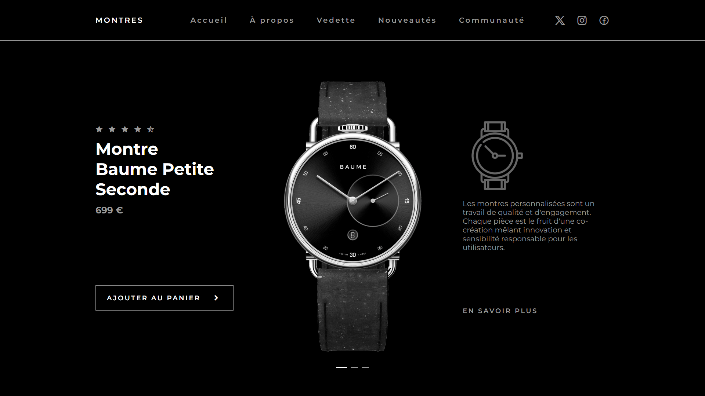

<div align="center">  
  <a href="https://image-slider-watch.netlify.app/" target="_blank">  
      
  </a>  
  </br></br>  
  <h3 align="center">⌚ Image Slider de Montres</h3>  
</div>

## <br /> 📌 Sommaire

&nbsp;&nbsp;&nbsp; 🎨 &nbsp; [**Introduction**](#introduction)<br />
&nbsp;&nbsp;&nbsp; 🛠️ &nbsp; [**Technologies**](#technologies)<br />
&nbsp;&nbsp;&nbsp; 🎯 &nbsp; [**Fonctionnalités**](#fonctionnalités)<br />
&nbsp;&nbsp;&nbsp; 🚀 &nbsp; [**Installation**](#installation)<br />

## <br /> <a name="introduction">🎨 Introduction</a>

Galerie animée de montres de luxe avec navigation créative et animations d’entrée GSAP.  
Chaque slide affiche un produit avec son nom, son prix, une image détaillée et une description complémentaire.

Parfait pour des landing pages de produits haut de gamme ou vitrines de boutique.

## <br /> <a name="technologies">🛠️ Technologies</a>

- HTML5 structuré
- CSS3 (variables, flex/grid, media queries)
- JavaScript ES6
- [Swiper.js](https://swiperjs.com/) (creative effect)
- [GSAP](https://gsap.com/) pour les animations
- Remix Icons

## <br /> <a name="fonctionnalités">🎯 Fonctionnalités</a>

- Effet **creative** sur les slides avec rotation et translation
- Animation GSAP lors du chargement des blocs
- Menu responsive avec ouverture/fermeture mobile
- Pagination interactive et fluide
- Présentation soignée et responsive des produits
- Texte explicatif et bouton d’action "en savoir plus"

## <br /> <a name="installation">🚀 Installation</a>

### ✅ Prérequis

- Navigateur moderne (Google Chrome)
- Éditeur de code (VS Code)

### 📥 Cloner le projet

```bash
git clone https://github.com/ValentinMadiot/img-slider-watches_js.git
```

### ▶️ Lancer localement

Il suffit d’ouvrir le fichier index.html dans un navigateur, ou d’utiliser l’extension Live Server sur VS Code.
